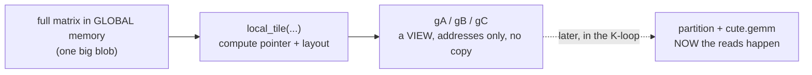
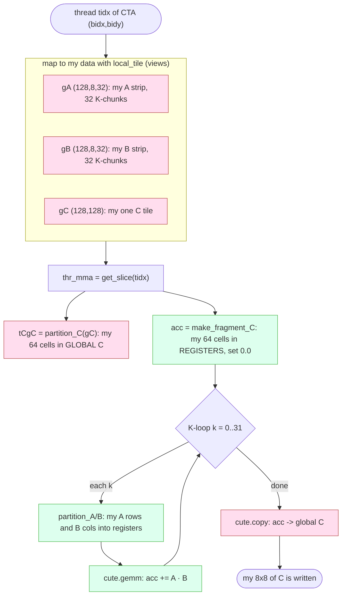

# Understanding the GEMM Kernel, Line by Line

This is a friendly, plain-language walkthrough of the kernel in `matmul_cute.py`.
It spends extra time on the two parts that trip people up: `cute.local_tile`
(how a CTA finds its data) and the thread-level partitioning (how one thread
finds its tiny piece and does the math). Read it alongside `learning.md` and
`matmul_cute_diagrams.md`.

The whole story in one breath: the big matrices live in slow global memory, we
hand each CTA a 128x128 chunk of the answer to compute, and inside that CTA the
256 threads each grab 64 little output cells, accumulate them in fast registers
across the K dimension, and write them back.

---

## 1. The problem `local_tile` actually solves

Here is the thing to internalize first. Every CTA runs the exact same kernel
code. There is no special source for "block 0" versus "block 3". The only thing
that changes between the 4 CTAs is the number that comes back from
`block_idx()`, which we call `bidx` and `bidy`.

So each CTA has to answer one question in code:

> "Given that I am CTA `(bidx, bidy)`, which slice of the giant global matrix is
> mine to work on?"

The full matrices sit in global memory as one long flat blob of numbers. To work
on "my" 128x128 region you need the correct pointer offset, shape, and strides.
Working that out by hand is exactly the fiddly, bug-prone index math that CuTe
wants to take off your plate:

```python
# the manual, painful version that local_tile replaces:
row0 = bidx * 128
col0 = 0
my_A_start = base_ptr_A + row0 * K_stride + col0 * 1   # plus bounds checks, plus ...
```

`local_tile` does that address arithmetic for you and hands back a clean view.

---

## 2. The mental model: score the matrix into tiles, then pick one

Picture matrix A (256x256) as a chocolate bar. `tiler=(128, 8)` says "score this
bar into pieces that are 128 tall and 8 wide."

```
A is 256 x 256, tiler = (128, 8)

rows:  256 / 128 = 2  row-tiles
cols:  256 /   8 = 32 col-tiles      ->  a 2 x 32 GRID OF TILES

        col-tile 0   col-tile 1  ...  col-tile 31
       +----------+----------+-----+----------+
row 0  | (0,0)    | (0,1)    | ... | (0,31)   |   128 x 8 each
       +----------+----------+-----+----------+
row 1  | (1,0)    | (1,1)    | ... | (1,31)   |   128 x 8 each
       +----------+----------+-----+----------+
```

Then `coord` decides which tile or tiles you want:

- An integer in a slot means "pick exactly this index along that axis."
- `None` in a slot means "do not pick anything here, keep every tile along this
  axis and stack them as an extra dimension I can loop over later."

That second rule is the part people miss, so keep it in mind.

---

## 3. The three calls with real numbers

### A: `gA = local_tile(mA, tiler=(128, 8), coord=(bidx, None))`

`mA` is `(256, 256)`, which is `(M, K)`. Cut it into `(128, 8)` tiles and you get
the 2 x 32 grid drawn above. The coord `(bidx, None)` means:

- row axis: pick row-tile `bidx`, so that dimension collapses to a single choice,
- K axis: `None`, so keep all 32 K-tiles.

Result shape is `(128, 8, 32)`, which reads as `(bM, bK, k_tiles)`. In words:
"my CTA's horizontal strip of A, 128 rows tall, chopped into 32 little 128x8
K-pieces that I will iterate through."

```
gA = my row-band of A:   [ tile_k0 | tile_k1 | ... | tile_k31 ]
                            128x8     128x8           128x8
                          \________________________________/
                                  shape (128, 8, 32)
```

### B: `gB = local_tile(mB, tiler=(128, 8), coord=(bidy, None))`

`mB` is the `(N, K)` view, which is `b.T`, also `(256, 256)`. Same idea: pick
column-band `bidy`, keep all 32 K-tiles. Result `(128, 8, 32)`, which is
`(bN, bK, k_tiles)`.

B is stored as `(N, K)` rather than `(K, N)` because `cute.gemm` contracts the
trailing mode of both A and B. So both the A-pieces and the B-pieces end with the
K dimension, lined up and ready to be multiplied and summed over K.

### C: `gC = local_tile(mC, tiler=(128, 128), coord=(bidx, bidy))`

`mC` is `(256, 256)`, which is `(M, N)`. Cut it into `(128, 128)` tiles and you
get a 2 x 2 grid. The coord `(bidx, bidy)` picks an integer on both axes, so
there is no `None` and nothing left to loop over. Result is `(128, 128)`, which
is `(bM, bN)`.

There is no third dimension here because the output has no K axis. Each CTA owns
exactly one finished 128x128 tile of C. A and B kept a K dimension only because
they have to be summed over K to produce that one tile.

---

## 4. Why A and B keep a `None` but C does not

| Tensor | Shape | Why the extra looped dimension (or not) |
|---|---|---|
| `gA` | `(128,8,32)` | A gets read 32 times, once per K-chunk, to build the sum. The `None` keeps all 32 K-pieces so the K-loop can step through them. |
| `gB` | `(128,8,32)` | Same story. B is consumed across all 32 K-chunks too. |
| `gC` | `(128,128)` | C is written once. There is nothing to iterate, the tile is the final answer, so both coords are fixed and there is no extra dimension. |

The K dimension is the contraction, the sum in `C[m,n] = sum over k of A·B`. A and
B carry K because they get summed over it. C does not have K because by the time
you write C, K has already been summed away.

---

## 5. What "no data moved yet" means

`local_tile` returns a view, which is just a pointer plus a layout. The layout is
pure math describing where each element would live in global memory. Nothing is
copied into shared memory or registers at this point. You have only computed
addresses.

The real reads happen later, inside the K-loop, when `partition_A` and
`partition_B` pull each thread's elements into registers and `cute.gemm` uses
them. So think of `local_tile` as handing you the map to your data, not the data
itself.



---

## 6. Zooming in: from the CTA tile to one thread

Up to now everything was about the CTA and its 128x128 tile. This next block is
where we drop down to a single thread. The CTA has 256 threads arranged as a
16x16 grid, and `128 x 128 / 256 = 64`, so each thread is responsible for 64
output values, an 8x8 worth of the tile. Here is how a thread claims and computes
its share.

```python
thr_mma = tiled_mma.get_slice(tidx)
```

`tiled_mma` describes how the whole 16x16 group of threads cooperates.
`get_slice(tidx)` says "I am thread `tidx`, give me the personalized view that
knows which elements belong to me." Every `partition_*` call after this uses that
view to hand this specific thread its slice.

```python
tCgC = thr_mma.partition_C(gC)
```

Take the CTA's 128x128 C tile and pull out this thread's elements, its 64 output
cells. `tCgC` still points at global memory. Think of it as the set of mailbox
addresses where this thread will eventually drop its answers.

```python
acc = tiled_mma.make_fragment_C(tCgC)
```

Allocate a register tensor of the same shape, those 64 values, living in the
fastest memory on the chip. The split in roles matters: `tCgC` is where the
answer goes in global memory, `acc` is where the answer is computed in registers.

```python
acc.fill(0.0)
```

Zero out the accumulators, because the K-loop is about to add into them.

### The K-loop, where the dot products get built

```python
k_tiles = cute.size(gA, mode=[2])   # this is 32
for k in cutlass.range(k_tiles):
```

`gA` had shape `(128, 8, 32)`, and mode 2 is that 32, the number of K-chunks. We
loop over them. `cutlass.range` is the DSL's loop, which lowers into the compiled
kernel correctly, so it is not a host-side Python loop.

```python
    tCrA = thr_mma.partition_A(gA[None, None, k])
```

`gA[None, None, k]` selects the k-th A chunk, a 128x8 tile. `partition_A` then
gives this thread the A rows it needs for its 8x8 output, loaded into registers.
The `r` in `tCrA` is a good reminder: it stands for register A.

```python
    tCrB = thr_mma.partition_B(gB[None, None, k])
```

Same move for B's k-th 128x8 chunk, giving this thread its B columns in
registers.

```python
    cute.gemm(tiled_mma, acc, tCrA, tCrB, acc)
```

This is the math. It computes `acc = tCrA · tCrB + acc`, so the thread multiplies
its A rows by its B columns and adds the result into its 64 accumulators. After
all 32 iterations finish, each accumulator holds a complete dot product over the
full K of 256.

### Writing the answer back

```python
copy_atom = cute.make_copy_atom(cute.nvgpu.CopyUniversalOp(), mC.element_type)
```

Build a descriptor for how to store fp32 values back to global memory. This is a
recipe for the copy, not the data being copied.

```python
cute.copy(copy_atom, acc, tCgC)
```

Copy this thread's finished `acc` from registers into `tCgC`, its 64 slots in
global C. Once all 256 threads have done this, the full 128x128 tile is written
and the CTA is done.

### The naming tells the whole story

- `g` means a global memory view: `gA`, `gB`, `gC`.
- `tC` means this thread's slice, the thread view partitioned for C.
- `r` means registers: `tCrA`, `tCrB`, the A and B pieces pulled into registers.
- `acc` is the register accumulator that slowly becomes the answer.

So the data path for one thread is:
`gA (global) -> tCrA (registers) -> cute.gemm -> acc (registers) -> tCgC (global)`.

---

## 7. The whole kernel, all together

```python
tidx, _, _   = cute.arch.thread_idx()   # who am I in my CTA?  0..255
bidx, bidy,_ = cute.arch.block_idx()    # which CTA am I?  picks my C tile

# Carve the global tensors into THIS CTA's tiles (views, no copy):
gA = cute.local_tile(mA, (128,  8 ), (bidx, None))  # (128, 8, 32)  my A row-band, all K-chunks
gB = cute.local_tile(mB, (128,  8 ), (bidy, None))  # (128, 8, 32)  my B col-band, all K-chunks
gC = cute.local_tile(mC, (128, 128), (bidx, bidy))  # (128, 128)    my single output tile

# Claim my personal slice and a register accumulator:
thr_mma = tiled_mma.get_slice(tidx)     # my thread's view of the tiled MMA
tCgC = thr_mma.partition_C(gC)          # my 64 output cells, still in global memory
acc  = tiled_mma.make_fragment_C(tCgC)  # my 64 accumulators, in registers
acc.fill(0.0)                           # start the sum at zero

# Walk the contraction dimension, 32 chunks of width 8:
k_tiles = cute.size(gA, mode=[2])       # 32
for k in cutlass.range(k_tiles):
    tCrA = thr_mma.partition_A(gA[None, None, k])   # my A rows for chunk k (registers)
    tCrB = thr_mma.partition_B(gB[None, None, k])   # my B cols for chunk k (registers)
    cute.gemm(tiled_mma, acc, tCrA, tCrB, acc)      # acc += A_piece · B_piece

# Store my finished accumulators back to global C:
copy_atom = cute.make_copy_atom(cute.nvgpu.CopyUniversalOp(), mC.element_type)
cute.copy(copy_atom, acc, tCgC)         # registers -> global C
```

---

## 8. Big-picture flow of one thread



Red boxes touch global memory, which is slow. Green boxes are registers, which
are fast. The kernel spends its life pulling small pieces into the green world,
grinding through the K-loop, and pushing one finished tile back out to red.

---

## 9. Two short summaries to lock it in

CTA level: `local_tile` exists because every CTA shares one kernel body and has
to figure out its own region of a big global matrix purely from `block_idx()`. It
scores the matrix into a grid of fixed-size tiles and selects yours by
coordinate, where an integer picks one tile and `None` keeps a whole axis of
tiles to loop over. A and B keep their K axis because they are summed across all
K-chunks, while C fixes both coordinates because each CTA produces exactly one
finished output tile. The returned `gA`, `gB`, and `gC` are just address maps,
and no data moves until the K-loop reads it.

Thread level: `get_slice(tidx)` plus `partition_C` give each thread its 64 output
cells of the 128x128 tile. The thread keeps a register accumulator, loops the 32
K-chunks while pulling its A rows and B columns into registers, and does
`acc += A·B` with `cute.gemm` each step. When the loop ends, `cute.copy` writes
those 64 finished values back to global C, and once all 256 threads finish, the
tile is complete.
